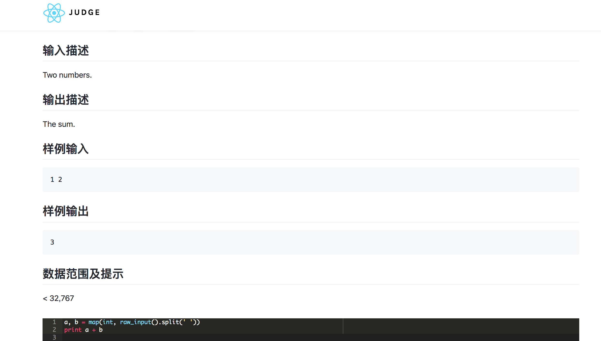

# judge-backend
Online Judge fontend.

see [backend](https://github.com/Means88/judge-backend)

## Requirements

- Docker
- Python3.6
- Node.js
- redis

## Installation

### backend
```bash
docker build -t judge-python docker/python/
pip install -r requirements.txt
python manage.py migrate
python manage.py createsuperuser

```

```bash
redis-server &
python -m celery -A config.celery worker --loglevel=info &
python manage.py runserver 0:8000

```

- Goto http://localhost:8000/admin
- Add problems and test data

### frontend

```bash
npm install -g yarn
yarn install
yarn start

```

## Preview




## LICENSE
MIT